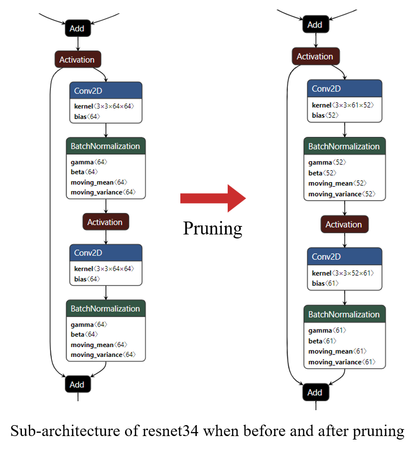

# Eagleeye: fast sub-net evaluation for efficient neural network pruning


:star: Star us on GitHub — it helps!!


Tensorflow keras implementation for *[EagleEye: Fast Sub-net Evaluation for Efficient Neural Network Pruning](https://arxiv.org/abs/2007.02491)*

## Install

You will need a machine with a GPU and CUDA installed.  
Then, you prepare runtime environment:

   ```shell
   pip install -r requirements.txt
   ```

## Use

### Train base model

If you want to train a network for yourself:

   ```shell
   python train_network.py --dataset_name=cifar10 --model_name=resnet34
   ```

Arguments:

- `dataset_name` - Select a dataset ['cifar10' or 'cifar100']
- `model_name` - Trainable network names
   - Available list
      - VGG: ['vgg11', 'vgg11_bn', 'vgg13', 'vgg13_bn', 'vgg16', 'vgg16_bn']
      - ResNet: ['resnet18', 'resnet34', 'resnet50', 'resnet101', 'resnet152']
      - MobileNet: ['mobilenetv2']
      - DenseNet: ['densenet40_f12','densenet100_f12']
- `batch_size` - Batch size
- `epochs` - The number of epochs
- `lr` - Learning rate
   - Default is 0.001 (set 0.01 when training mobilenetv2)

Else if you want to use a pre-trained model, download the model through a download link in the below result section.
Please put the downloaded models in the directory of `./saved_models/`.


### Prune the model using EagleEye!!

Next, you can prune the trained model as following:

   ```shell
   python main.py --dataset_name=cifar10 --model_path=./saved_models/cifar10_resnet34.h5 --epochs=100 --min_rate=0.0 --max_rate=0.5 --num_candidates=15
   ```

Arguments:

- `dataset_name` - Select a dataset ['cifar10' or 'cifar100']
- `model_path` - Model path
- `bs` - Batch size
- `epochs` - The number of epochs
- `lr` - Learning rate
- `min_rate` - Minimum rate of search space
- `max_rate` - Maximum rate of search space
- `num_candidates` - The number of candidates


## Result

The result of progress looks like as following:
```
Adaptive-BN-based accuracy for 0-th prunned model: 0.08163265138864517
Adaptive-BN-based accuracy for 1-th prunned model: 0.20527011036872864
Adaptive-BN-based accuracy for 2-th prunned model: 0.10084033757448196
...
Adaptive-BN-based accuracy for 13-th prunned model: 0.10804321616888046
Adaptive-BN-based accuracy for 14-th prunned model: 0.11284513771533966

The best candidate is 1-th prunned model (Acc: 0.20527011036872864)

Epoch 1/200
196/195 [==============================] - 25s 125ms/step - loss: 1.7189 - accuracy: 0.4542 - val_loss: 1.8755 - val_accuracy: 0.4265
...

Test loss (on base model): 0.3912913203239441
Test accuracy (on base model): 0.9172999858856201
The number of parameters (on base model): 33646666
The number of flops (on base model): 664633404

Test loss (on pruned model): 0.520440936088562
Test accuracy (on pruned model): 0.9136999845504761
The number of parameters (on pruned model): 27879963
The number of flops (on prund model): 401208200
```

Then, the pruned model will be saved in `./result/`(default) folder.  
A result example is represented when before and after pruning:




### ResNet 34 on cifar10

|Model|Acc|[min_rate, max_rate]|Flops|Param num|File size|Download|
|-----|---|--------------------|-----|---------|---------|--------|
|Original|90.11%|None|145M|1.33M|5.44MB|[cifar10_resnet34.h5](https://drive.google.com/file/d/1SJS61fUh_GsnlBI3WB__JtdO70Zfj7Ms/view?usp=sharing)|
|Pruned|90.50%|[0, 0.5]|106M|0.86M|3.64MB|[cifar10_resnet34_pruned0.5.h5](https://drive.google.com/file/d/1VRTAiIvF7B7-AejxLunaCtOWFTan5p0U/view?usp=sharing)|
|Pruned|89.02%|[0, 0.7]|69M|0.55M|2.60MB|[cifar10_resnet34_pruned0.7.h5](https://drive.google.com/file/d/1z77mbXxagEyc9TKxDXISgNmQ-74Tkc0_/view?usp=sharing)|
|Pruned|89.30%|[0, 0.9]|62M|0.54M|2.52MB|[cifar10_resnet34_pruned0.9.h5](https://drive.google.com/file/d/1uBJoaovFkEwSbaF_AggxUP70MShPOJSc/view?usp=sharing)|

### ResNet 18 on cifar10

|Model|Acc|[min_rate, max_rate]|Flops|Param num|File size|Download|
|-----|---|--------------------|-----|---------|---------|--------|
|Original|88.30%|None|70.2M|0.70M|2.87MB|[cifar10_resnet18.h5](https://drive.google.com/file/d/1fu_DlI-YLm3IunHFmq-UFi-p4ecXBUq6/view?usp=sharing)|
|Pruned|88.02%|[0, 0.5]|50.9M|0.47M|2.01MB|[cifar10_resnet18_pruned0.5.h5](https://drive.google.com/file/d/187fYZvDfHj8w_YM_JguPyet0SsPD8GXg/view?usp=sharing)|
|Pruned|87.09%|[0, 0.7]|33.1M|0.26M|1.20MB|[cifar10_resnet18_pruned0.7.h5](https://drive.google.com/file/d/18nrWoX-1TKtLFbiedOkJywHxUS6PGpfo/view?usp=sharing)|
|Pruned|85.65%|[0, 0.9]|21.4M|0.08M|0.51MB|[cifar10_resnet18_pruned0.9.h5](https://drive.google.com/file/d/1JjoqWf3motY_swaQ4rBIQMRTteJo2zsL/view?usp=sharing)|


### VGG 16_bn on cifar10

|Model|Acc|[min_rate, max_rate]|Flops|Param num|File size|Download|
|-----|---|--------------------|-----|---------|---------|--------|
|Original|91.99%|None|664M|33.64M|128MB|[cifar10_vgg16_bn.h5](https://drive.google.com/file/d/1YZJ-I5V2RZOwMYwwY5T7VhQd48wPsTQb/view?usp=sharing)|
|Pruned|91.44%|[0, 0.5]|394M|26.27M|100MB|[cifar10_vgg16_bn_pruned0.5.h5](https://drive.google.com/file/d/1T_dHGEJphXzufahiimdSH6U-CCaNV9po/view?usp=sharing)|
|Pruned|90.81%|[0, 0.7]|298M|25.18M|96.2MB|[cifar10_vgg16_bn_pruned0.7.h5](https://drive.google.com/file/d/1u15n_rRYd-ARaIF-IPP57MAFyoMfU7Q7/view?usp=sharing)|
|Pruned|90.42%|[0, 0.9]|293M|21.9M|83.86MB|[cifar10_vgg16_bn_pruned0.9.h5](https://drive.google.com/file/d/1Hm1Ui068Cd7fdVg_-VytZ7sstTMoP9MK/view?usp=sharing)|

### MobileNetv2 on cifar10

|Model|Acc|[min_rate, max_rate]|Flops|Param num|File size|Download|
|-----|---|--------------------|-----|---------|---------|--------|
|Original|90.14%|None|175M|2.23M|9.10MB|[cifar10_mobilenetv2_bn.h5](https://drive.google.com/file/d/1zVtZ2jwNTyn3Bo0D8V0xfRPpEjWZg09s/view?usp=sharing)|
|Pruned|90.57%|[0, 0.5]|126M|1.62M|6.72MB|[cifar10_mobilenetv2_pruned0.5.h5](https://drive.google.com/file/d/1MLg909rak-78fZ5gHOsLMFBy2deXzZkJ/view?usp=sharing)|
|Pruned|89.13%|[0, 0.7]|81M|0.90M|3.96MB|[cifar10_mobilenetv2_pruned0.7.h5](https://drive.google.com/file/d/1CDYObh6cJUIRS0Gc4m6BmVlQejcVs8We/view?usp=sharing)|
|Pruned|90.54%|[0, 0.9]|70M|0.62M|2.92MB|[cifar10_mobilenetv2_pruned0.9.h5](https://drive.google.com/file/d/1GjUXOepwrMkBOYm5c239wJP64sHLrb-8/view?usp=sharing)|

### DenseNet40 on cifar10

|Model|Acc|[min_rate, max_rate]|Flops|Param num|File size|Download|
|-----|---|--------------------|-----|---------|---------|--------|
|Original|91.32%|None|51M|1.00M|4.27MB|[cifar10_densenet40_bn.h5](https://drive.google.com/file/d/1gHUozIUE9pLGMekbP9lM5oqcw_Q_rgYX/view?usp=sharing)|
|Pruned|91.13%|[0, 0.5]|32M|0.68M|3.07MB|[cifar10_densenet40_pruned0.5.h5](https://drive.google.com/file/d/1GCC3KSiJsHjUjQsO2ZL2L0HjUvBYP4F9/view?usp=sharing)|
|Pruned|90.95%|[0, 0.7]|24M|0.54M|2.49MB|[cifar10_densenet40_pruned0.7.h5](https://drive.google.com/file/d/1F-5pk36kTMSqgs8zqaWWl8mC06AG5D_Z/view?usp=sharing)|
|Pruned|90.31%|[0, 0.9]|20M|0.41M|2.00MB|[cifar10_densenet40_pruned0.9.h5](https://drive.google.com/file/d/1LLH8s5SAo3kyoQ556W_ePDDTuh8DomMO/view?usp=sharing)|

### DenseNet100 on cifar10

|Model|Acc|[min_rate, max_rate]|Flops|Param num|File size|Download|
|-----|---|--------------------|-----|---------|---------|--------|
|Original|93.26%|None|2540M|3.98M|16.4MB|[cifar10_densenet100_bn.h5](https://drive.google.com/file/d/1GmCfYv32MnoWvSyoYc7M26AhNGc2xRSI/view?usp=sharing)|
|Pruned|93.12%|[0, 0.5]|1703M|2.74M|11.6MB|[cifar10_densenet100_pruned0.5.h5](https://drive.google.com/file/d/1RLNUeS4DKdSAGf1iUaY9FoDn1LEymdUJ/view?usp=sharing)|
|Pruned|93.12%|[0, 0.7]|1467M|2.41M|10.4MB|[cifar10_densenet100_pruned0.7.h5](https://drive.google.com/file/d/17KCmlrBfuecI0Qke45W78wCF6WnauVkp/view?usp=sharing)|
|Pruned|93.00%|[0, 0.9]|1000M|1.65M|7.44MB|[cifar10_densenet100_pruned0.9.h5](https://drive.google.com/file/d/1q5yvwSd146wYm2hnTWfTac3mQ-F1hzhe/view?usp=sharing)|


:no_entry: If you run this code, the result would be a bit different from mine.


## Understanding this paper

:white_check_mark: Check my blog!!
[Here](https://da2so.github.io/2020-10-25-EagleEye_Fast_Sub_net_Evaluation_for_Efficient_Neur_Network_Pruning/)